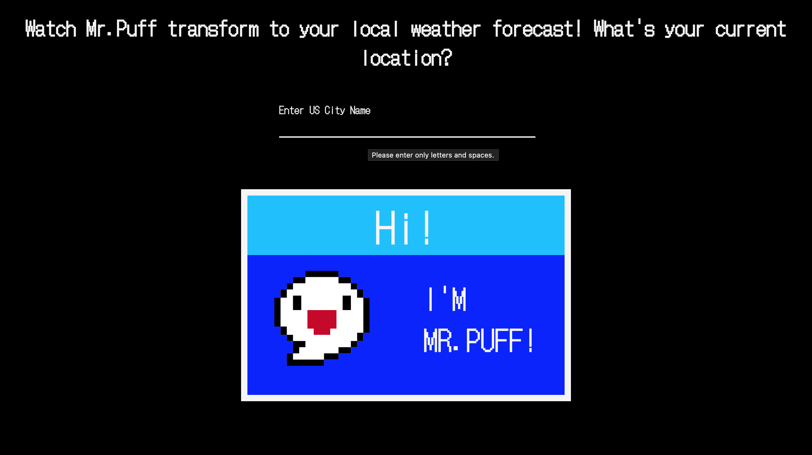

# Weather-project

### This is an 8-bit weather forecast website featuring a fictional character, Mr.Puff, as your weather man.

This project was completed for The Code the Dream advanced pre-work assignment.The aim of the assignment was to build a website using a given selection of public APIs. I choose Open-Meteo - a weather API.

## Built With 

- Vanilla JS
- HTML5
- CSS3

## Prerequisites

You will need a web browser to view this project. No set up required. Works best on:

- Firefox
- Google Chrome
- Safari

## Live Demo

<https://raybgomez.github.io/Weather-project/>

Deployed on [GitHub Pages](https://pages.github.com/) 

### Usage

Click on the above live demo link. You will see a searchbox labeled "Enter US City Name"
- **Step 1**. Type in the name of a US city. No need to type in the state.
- **Step 2**. Hit the enter key. City name will display below.
- **Step 3**. Current temperature will display at the top of the box.
- **Step 4**. Display the weather condition by clicking the "Show Condition" link at the bottom.
- **Step 5**. Click "Show Temperature" to display the current temperature again.

 

## Acknowledgement

Design inspired by 8-bit retro gaming and [SVG Weather Vectors](https://www.svgrepo.com/collection/weather-35/)

## Contributing

Contributions, issues, and feature requests are welcome!

## Show your support

Show your love by hitting the ⭐️ button, I'd really appreciate it.
